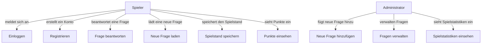

# Quizzgame
Quizzgame für Lernfeld 8 - Gruppe 15

Smart Ziel: Unsere Gruppe hat das Ziel bis zum 08.04.2025 eine fertige funktionierende Quiz Website aufzubauen, auf welcher Nutzer qualifiziert ihr Wissen testen können.

S = Das  Ziel ist spezifisch benannt: Eine fertige funktionierende Website

M = Das Ergebnis ist messbar: Funktionierende Website und Nutzer können die Website fehlerfrei nutzen

A = Das Ziel ist erreichbar: Die Website kann in dieser Zeit funkionell und fehlerfrei aufgebaut werden

R = Das Ziel ist realisitisch: Die Website sollte in dieser Zeit aufbaubar sein

T = Die Ergebnis-Zeit ist benannt: Bis zum 08.04.2025

# UseCase Diagramm

